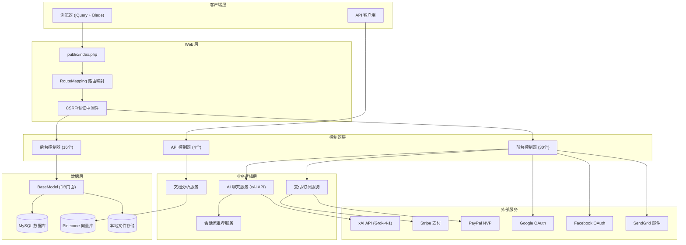
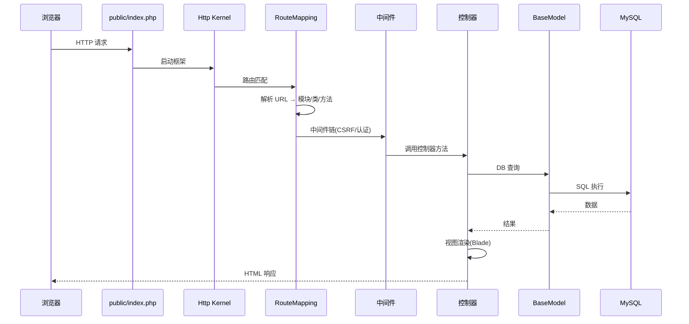
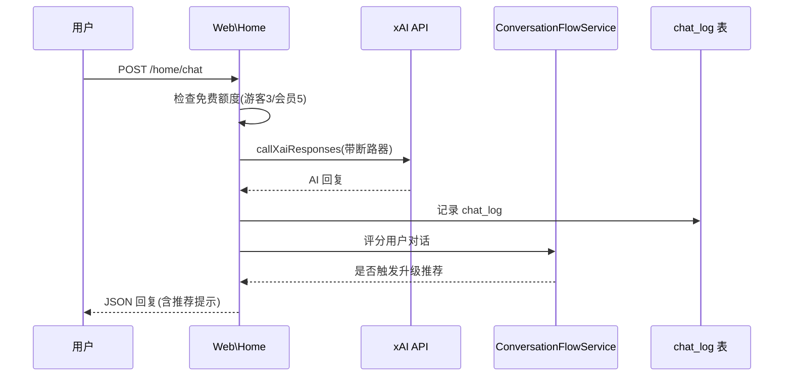

# AI-mmi 系统架构文档

## 概述

AI-mmi (AI Migration & Education Assistant) 是一个基于 Laravel 8 的全栈 Web 应用，功能涵盖智能移民咨询、留学申请、社区论坛、付费订阅、文档分析等模块。该平台面向有移民和留学需求的用户，提供从信息获取、AI 智能咨询、签证申请、到移民代理/服务商对接的完整服务链路。

系统采用 Laravel MVC 架构，前端使用 jQuery + iWeb UI 框架，后端通过自定义路由映射引擎实现多语言 URL 自动路由，AI 聊天模块直接调用 xAI (Grok-4-1) 大模型，支付模块集成 Stripe 和 PayPal。

## 技术栈

**语言与运行时**
- PHP ^7.3|^8.0
- JavaScript (jQuery 3.x)
- HTML/CSS (Blade 模板)

**框架**
- Laravel 8.75 - Web 框架
- Laravel Mix 6 - 前端构建
- PHPUnit 9.5 - 测试框架

**数据存储**
- MySQL - 主数据库
- 本地文件系统 - 文件/图片存储
- Pinecone - 向量数据库(RAG)

**基础设施**
- Apache/Nginx - Web 服务器
- Composer - PHP 依赖管理
- NPM - 前端依赖管理

**外部服务**
- xAI API (Grok-4-1-fast-reasoning) - AI 聊天
- Stripe - 支付网关(Checkout + Subscription)
- PayPal NVP API - 支付网关
- Google OAuth - 社交登录
- Facebook OAuth - 社交登录
- Google reCAPTCHA - 安全验证
- SendGrid - 邮件服务

## 项目结构

```
ai-mmi-backup-2025-08-06/
├── app/                          # 应用核心代码
│   ├── Console/                  # Artisan 控制台命令
│   ├── Http/
│   │   ├── Controllers/          # 控制器层
│   │   │   ├── Admin/            # 后台控制器(16个)
│   │   │   ├── Api/              # API 控制器(4个)
│   │   │   └── Web/              # 前台控制器(30个)
│   │   └── Middleware/           # HTTP 中间件(9个)
│   ├── Libraries/                # 第三方库(PayPal/PHPExcel/SendGrid/QRCode/PDF)
│   ├── Models/                   # 数据模型(11个)
│   ├── Providers/                # 服务提供者(5个)
│   ├── Rules/                    # 自定义验证规则
│   ├── Services/                 # 业务服务层
│   │   └── Rag/                  # RAG 检索增强生成模块
│   └── Support/                  # 工具类
├── bootstrap/                    # 框架启动
├── config/                       # 配置文件(17个)
├── database/
│   ├── factories/                # 测试数据工厂
│   ├── migrations/               # 数据库迁移(17个)
│   └── seeders/                  # 种子数据
├── public/                       # Web 入口和静态资源
│   ├── asset/
│   │   ├── js/web/               # 前台 JS(22个)
│   │   ├── js/admin/             # 后台 JS(10个)
│   │   └── lib/                  # 第三方前端库(jQuery/TinyMCE/Slick等)
│   └── upload/                   # 上传文件存储
├── resources/
│   ├── lang/                     # 多语言文件(en/zh-hans/zh-hant)
│   ├── views/                    # Blade 视图模板
│   │   ├── web/                  # 前台视图(43个)
│   │   ├── admin/                # 后台视图(14个)
│   │   └── components/           # 可复用组件
│   ├── css/                      # 源样式文件
│   └── js/                       # 源 JS 文件
├── routes/                       # 路由定义(4个)
├── storage/                      # Laravel 存储(日志/缓存)
├── tests/                        # 测试文件
├── composer.json                 # PHP 依赖配置
├── package.json                  # 前端依赖配置
└── webpack.mix.js                # Laravel Mix 构建配置
```

**入口点**
- `public/index.php` - Web 应用入口
- `artisan` - CLI 命令入口
- `routes/web.php` - Web 路由定义(通配路由转入 RouteMapping)
- `routes/api.php` - API 路由定义

## 子系统

### 路由映射引擎
**目的**: 将 URL 段自动映射到对应的模块/类/方法，支持多语言和后台分离
**位置**: `app/Http/Controllers/RouteMapping.php`
**路由规则**:
- `/admin/{class}/{function}/{params...}` → `App\Http\Controllers\Admin\{Class}`
- `/{language}/{class}/{function}/{params...}` → `App\Http\Controllers\Web\{Class}`
- `/{class}/{function}/{params...}` → `App\Http\Controllers\Web\{Class}` (单语言模式)
**依赖**: 无外部依赖
**被依赖**: 所有 Web 请求

### AI 聊天系统
**目的**: 提供多语言 AI 移民留学咨询服务，集成 xAI 大模型
**位置**: `app/Http/Controllers/Web/Home.php` (`chat()` / `callXaiResponses()`)
**关键能力**:
- 直接调用 xAI API (Grok-4-1-fast-reasoning)
- 断路器模式/重试/降级机制
- 内部知识库搜索 + Web 搜索工具调用
- 自动检测用户语言并同语言回复
- 游客3次/免费会员5次/付费会员无限制
- 多线程无状态(不依赖多轮上下文)
**依赖**: cURL, xAI API
**被依赖**: 前台首页聊天窗口

### 会话流智能推荐
**目的**: 根据用户对话内容评分，智能触发套餐升级提示
**位置**: `app/Services/ConversationFlowService.php`, `config/conversation_flows.php`
**关键能力**:
- 关键词和行为信号评分系统(>5分触发推荐)
- 套餐升级提示冷却和频率控制
- 多语言提示模板(Free → AI Smart → Hybrid Expert → Premium Confidence → VIP)
**依赖**: Member Model, 聊天记录
**被依赖**: AI 聊天系统

### 认证系统
**目的**: 前后台双用户体系的认证和授权
**位置**: `app/Models/Member.php`(前台), `app/Models/User.php`(后台), `app/Http/Middleware/AdminAuthn.php`
**关键能力**:
- 前台: 基于 member 表的自定义 Token(Cookie/Session) + Google/Facebook OAuth
- 后台: 基于 user 表的 Token(Session) + IP 白名单
- API: Laravel Sanctum Token
**依赖**: Database, Cookie, Session
**被依赖**: 所有需认证的页面和 API

### 支付/订阅系统
**目的**: 处理套餐订阅、付款和 Stripe Webhook 事件
**位置**: `app/Http/Controllers/StripeWebhookController.php`, `app/Libraries/PaypalApi.php`
**关键能力**:
- Stripe: Checkout Session + Subscription + Invoice 事件处理
- PayPal: NVP API 封装(支付/退款/预授权)
- 五级套餐: Free / AI Smart / Hybrid Expert / Premium Confidence / VIP
**依赖**: Stripe PHP SDK, PayPal NVP API, Member Model
**被依赖**: 套餐升级、签证提交付款

### 文档分析与 RAG
**目的**: 上传文档的解析、文本提取、向量化和检索增强生成
**位置**: `app/Services/DocumentAnalysisService.php`, `app/Services/Rag/`, `app/Http/Controllers/Api/DocumentController.php`
**关键能力**:
- PDF 文档上传和文本提取
- 文档切片(Chunker) → 嵌入向量(Embeddings) → Pinecone 存储
- 基于检索结果增强 AI 回答
- 文件 MD5 去重
**依赖**: smalot/pdfparser, Pinecone
**被依赖**: AI 聊天(AI 工具调用)

### 动态模板引擎
**目的**: 后台管理页面的模板化生成，通过配置数组动态生成列表/表单
**位置**: `app/Http/Controllers/AdminController.php`
**关键能力**:
- `templateListView()`: 基于配置数组生成列表页(搜索/排序/分页)
- `templateFormView()`: 基于配置数组生成表单页(字段类型/验证/联动)
**依赖**: BaseModel, Blade 模板(template/list, template/form)
**被依赖**: 所有后台 CRUD 页面

## 架构图



## 请求生命周期



## AI 聊天流程



## 设计决策

1. **自定义路由映射替代 Laravel 默认路由**：支持动态多语言 URL 解析，减少手动路由定义。代价是增加了 URL 到控制器映射的调试复杂度。

2. **全手动 ORM 替代 Eloquent**：继承自 BaseModel 使用 DB 门面直接操作，原因可能是历史代码迁移或性能考虑。代价是失去了 Eloquent 的关系映射、事件和类型安全。

3. **自定义模板引擎替代 Blade Components**：后台通过 AdminController 的 `templateListView/templateFormView` 方法动态生成页面，适合大量相似 CRUD 页面。代价是灵活性降低。

4. **AI 多线程无状态设计**：不维护多轮对话上下文，每次请求独立，通过断路器/重试/降级保证可用性。这是针对大模型 API 不稳定性做的容错设计。

5. **双用户体系(前台 member + 后台 user)**：前后台账户完全隔离，简化权限模型。前台支持社交登录满足 C 端用户需求，后台独立认证满足管理需求。
