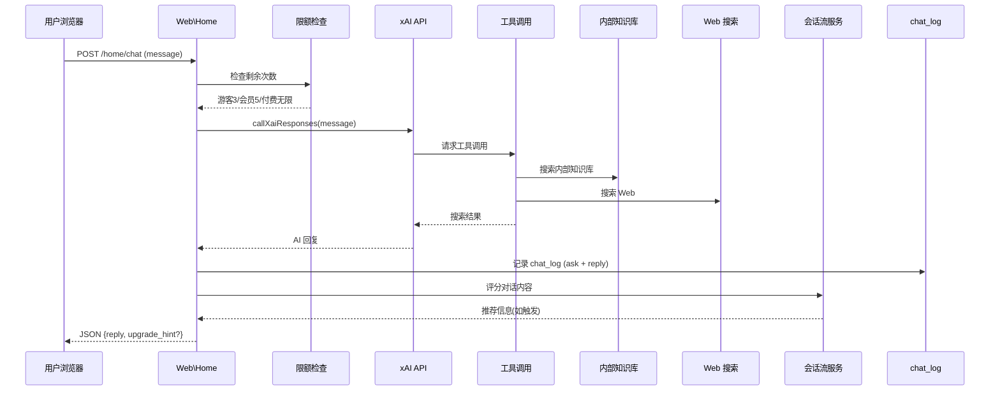

# AI 聊天 (AI Chat)

系统的核心功能模块，通过 xAI 大模型提供多语言移民留学智能咨询服务。

## 什么是 AI 聊天？

AI-mmi 的 AI 聊天系统是用户获取移民和留学信息的智能入口。系统直接调用 xAI API (Grok-4-1-fast-reasoning 模型)，支持内部知识库搜索和 Web 搜索作为工具调用，自动检测用户语言并同语言回复。为保障服务稳定性，系统内置了断路器、重试和降级机制。

**关键特征**:
- 基于 xAI Grok-4-1 大模型，cURL 直连
- 多线程无状态(不依赖多轮上下文)，每次请求独立
- 工具调用: 内部知识库搜索 + Web 搜索
- 自动语言检测(中/英/日/法/西/德/俄/韩/阿/葡)
- 游客3次/免费会员5次/付费会员无限次
- 断路器模式: 连续失败后熔断，定期半开检测恢复
- 降级策略: 大模型不可用时返回预置回复

## 代码位置

| 方面 | 位置 |
|------|------|
| 控制器 | `app/Http/Controllers/Web/Home.php` (chat + callXaiResponses) |
| 服务层 | `app/Services/ConversationFlowService.php` |
| 会话规则 | `config/conversation_flows.php` |
| API 日志 | `app/Http/Controllers/Api/ChatController.php` |
| 聊天记录 | `chat_log` 表 |
| 前端 | `public/asset/js/web/home.js` + `public/asset/js/web/welcome_message.js` |
| 视图 | `resources/views/web/home.blade.php` + `resources/views/components/welcome-message.blade.php` |
| 测试页 | `app/Http/Controllers/Web/Testchat.php` (含 Dialogflow/Gemini/ChatGPT 测试代码) |

## 聊天流程

## chat_log 表结构

| 字段 | 描述 |
|------|------|
| `id` | 主键 |
| `member_id` | 会员 ID(登录用户) |
| `guest_id` | 游客 ID(含索引) |
| `session_id` | 会话 ID(含索引) |
| `related_id` | 关联 ID(ask-reply 配对) |
| `type` | 消息类型: ask / reply |
| `content` | 消息内容 |
| `chat_mode` | 聊天模式: immigration |
| `reply_source` | 回复来源标识 |

## 断路器机制

`callXaiResponses()` 内置断路器模式:
1. **闭合状态**: 正常调用 xAI API
2. **半开状态**: 连续失败 N 次后，尝试一次探测调用
3. **断开状态**: 探测失败，直接返回降级回复，定期尝试恢复
4. **关闭恢复**: 探测成功，恢复到闭合状态

## 限额管理

| 用户类型 | 每日限额 | 重置方式 |
|---------|---------|---------|
| 游客 | 3 次 | 按 guest_id 计数 |
| 免费会员 | 5 次 | 按 member_id 计数，登录后 |
| 付费会员 | 无限 | 不检查 |

## 关键业务规则

1. 每次提问和回复都记录到 chat_log(一对 ask-reply 记录)
2. guest_id 和 session_id 用于关联未登录用户的对话
3. 同一 session_id 的消息按时间排序展示历史
4. 工具调用(知识库/Web搜索)的结果不单独存储
5. 断路器状态存储在文件/缓存中，不依赖数据库
