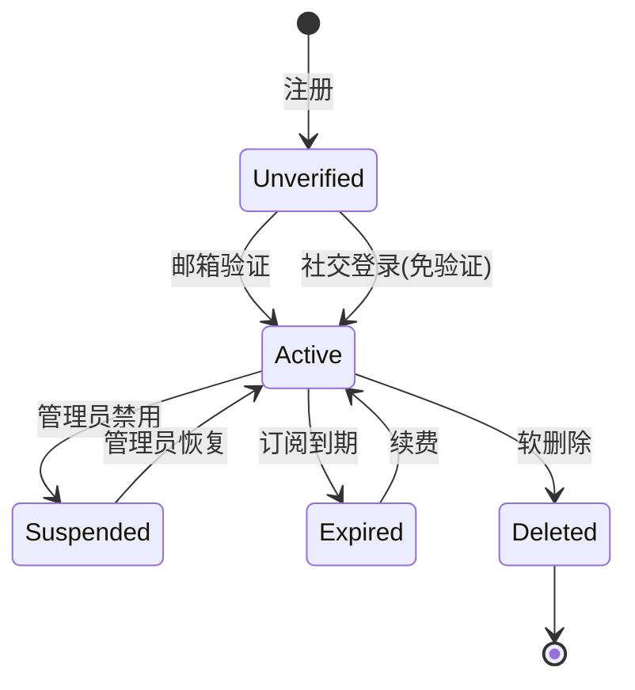
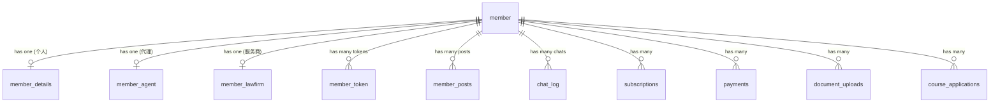

# 会员 (Member)

会员是系统的前台用户实体，覆盖个人用户、移民代理和服务提供商三种类型。

## 什么是会员？

会员是 AI-mmi 平台的核心用户概念。系统将用户分为三种类型：**个人用户**(type=1)寻求移民/留学咨询，**移民代理**(type=2)提供专业移民服务，**服务提供商**(type=3)提供相关配套服务(法律/教育等)。

**关键特征**:
- 三种用户类型各有独立的详细资料表
- 支持邮箱/密码登录和 Google/Facebook OAuth 社交登录
- 自定义 Token 认证(非 Eloquent Auth)
- 注册支持付费套餐，订阅到期后需续费
- 软删除，通过 status 字段标记

## 代码位置

| 方面 | 位置 |
|------|------|
| 模型 | `app/Models/Member.php` (1148行) |
| 控制器 | `app/Http/Controllers/Web/Account*.php` |
| 数据库 | `member` 表 |
| 扩展详情 | `member_details` / `member_agent` / `member_lawfirm` / `member_business_license` 表 |
| Token | `member_token` 表 |
| 前端视图 | `resources/views/web/account*.blade.php` |

## 数据库结构

### member 主表
| 字段 | 类型 | 描述 |
|------|------|------|
| `id` | int | 主键 |
| `email` | varchar | 邮箱(唯一) |
| `password` | varchar | 加密密码 |
| `type` | tinyint | 用户类型: 1个人/2移民代理/3服务商 |
| `alias_name` | varchar | 别名/昵称 |
| `full_name` | varchar | 真实姓名 |
| `verified` | tinyint | 邮箱是否已验证 |
| `social_provider` | varchar | 社交登录来源(google/facebook) |
| `social_id` | varchar | 社交平台用户 ID(含索引) |
| `status` | tinyint | 状态(含软删除标记) |

### 关联详情表

- **member_details**: 个人用户信息(国籍/职业/签证兴趣/话题兴趣)
- **app_member_details**: 扩展详情(服务国家/注册商业信息)
- **member_agent**: 移民代理信息(公司名/注册号/服务国家)
- **member_lawfirm**: 服务商信息(律所名/服务类型/执照号)
- **member_business_license**: 营业执照(颁发机构/注册号/状态)
- **member_token**: 认证 Token(登录/密码重置)

## 生命周期

## 关系

## 关键业务规则

1. 邮箱必须唯一，社交登录时通过 social_provider + social_id 组合识别
2. 个人用户注册后 type=1 不可变，代理和服务商注册需填写额外信息
3. 密码重置 Token 有时效性(expiry_at 字段)
4. 登录 Token 用于 Cookie 认证，Web 中间件自动校验
5. 免费会员 AI 提问限制 5 次，游客 3 次，付费会员无限制
