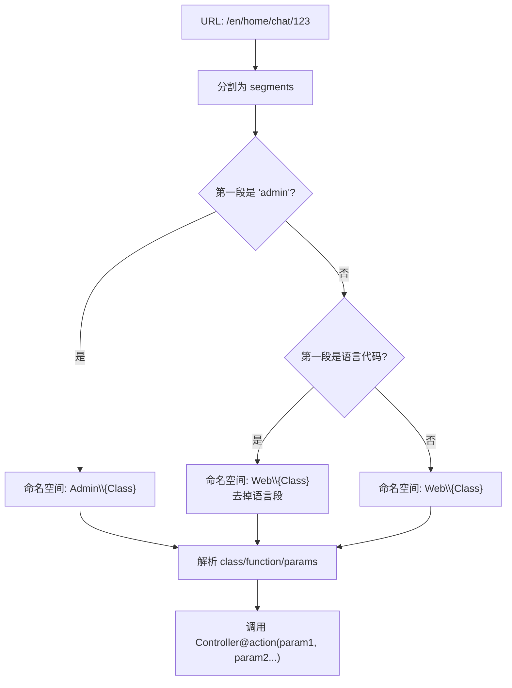

# 路由映射 (RouteMapping)

系统的 URL 路由引擎，将 URL 段自动解析为控制器类和方法调用。

## 什么是路由映射？

RouteMapping 是 AI-mmi 的核心路由引擎，替代 Laravel 默认的路由注册机制。它将 URL 拆分为段(segments)，按规则自动映射到 `App\Http\Controllers\{Module}\{Class}@{action}`。支持多语言 URL 前缀、后台模块隔离和数字参数动态路由。

**关键特征**:
- URL 段自动映射，无需手动注册每个路由
- 多语言前缀支持: `/{language}/{class}/{function}`
- 后台前缀识别: `/admin/{class}/{function}`
- 数字参数自动识别并注入方法
- 支持 JSON 响应头识别(AJAX 请求)

## 代码位置

| 方面 | 位置 |
|------|------|
| 路由引擎 | `app/Http/Controllers/RouteMapping.php` (238行) |
| Web 路由 | `routes/web.php` |
| 中间件映射 | `config/app_portal.php` (admin_middleware 配置) |

## 映射规则

### URL 格式

| 模式 | 示例 | 解析结果 |
|------|------|---------|
| `/admin/{class}/{function}/{params}` | `/admin/members/index/1` | `Admin\Members@index(1)` |
| `/{lang}/{class}/{function}/{params}` | `/en/home/chat` | `Web\Home@chat()` |
| `/{class}/{function}/{params}` | `/home/index` | `Web\Home@index()` |
| `/` | `/` | `Web\Home@index()` (默认) |

### 语言代码检测

RouteMapping 检查 URL 第一段是否为支持的语言代码(en/zh-hant/zh-hans)，如果是则：
1. 设置当前语言(Session/Cookie)
2. 去掉语言段后再解析剩余段
3. 将语言传递给控制器

### 数字参数注入

URL 中的纯数字段自动识别为参数，按位置注入到控制器方法:
- `/posts/details/123` → `Web\Posts@details(123)`
- `/admin/members/edit/1/2` → `Admin\Members@edit(1, 2)`

## 关键的 URL 映射

| 第一段 | 命名空间 | 默认类 | 默认方法 |
|--------|---------|--------|---------|
| `admin` | `Admin` | `Home` | `index` |
| 语言代码 | `Web` | `Home` | `index` |
| 其他 | `Web` | `Home` | `index` |

不足3段的 URL 自动补全默认值: `class` 默认 `Home`，`function` 默认 `index`。

## 中间件链

RouteMapping 调用控制器前经过以下中间件(由 `config/app_portal.php` 配置):
- `admin.*` → `AdminAuthn` (IP白名单 + Token认证 + 权限检查)
- `web` 组 → 标准 Laravel Web 中间件

## 注意事项

1. `php artisan route:list` 只会显示 `routes/` 文件中显式注册的路由(仅通配路由和 Stripe Webhook)，不会显示动态映射的路由
2. URL 段与控制器文件名的映射是大小写敏感的
3. 控制器文件名需为 PascalCase，URL 中的类名部分为 snake_case 自动转换
4. `admin` 是保留的第一段关键词，不能用作前台类名
