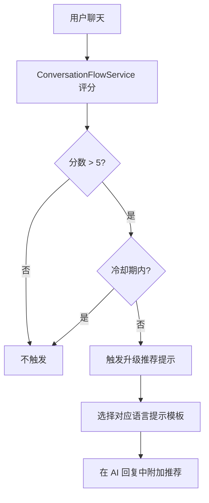

# 套餐与订阅 (Subscription)

系统的付费体系，用户通过订阅不同套餐获得不同级别的 AI 咨询和移民服务权益。

## 什么是套餐与订阅？

AI-mmi 提供五级付费套餐体系，用户按需订阅。系统通过 Stripe 处理订阅付款，并结合 AI 聊天中的会话流服务智能推荐用户升级套餐。

**关键特征**:
- 五级递进套餐: Free → AI Smart → Hybrid Expert → Premium Confidence → VIP
- Stripe Checkout + Subscription 自动化付款
- 会话流服务根据聊天内容智能评分触发升级推荐
- 套餐权益通过 plan_entitlements 表灵活配置(配额/周期/价格)
- 订阅有有效期(started_at → ends_at)，到期后需续费

## 代码位置

| 方面 | 位置 |
|------|------|
| 模型 | `app/Models/Member.php` (订阅相关方法) |
| 支付处理 | `app/Http/Controllers/StripeWebhookController.php` |
| 支付库 | `app/Libraries/PaypalApi.php` |
| 会话流 | `app/Services/ConversationFlowService.php` |
| 会话流规则 | `config/conversation_flows.php` |
| 套餐配置 | `database/migrations/2025_09_30_000001_create_plans_table.php` |
| 权益配置 | `database/migrations/2025_09_30_000003_create_plan_entitlements_table.php` |
| 数据库 | `plans`, `services`, `plan_entitlements`, `subscriptions`, `payments` |

## 数据库结构

### plans 表
| 字段 | 描述 |
|------|------|
| `id` | 主键 |
| `code` | 唯一标识: free / all_ai / hybrid / premium / vip |
| `name` | 套餐名称(多语言) |
| `duration_months` | 有效期(月) |
| `price_usd` | 价格(美元) |
| `business_domain` | 适用业务领域 |
| `is_active` | 是否启用 |
| `stripe_price_id` | Stripe 价格 ID |

### subscriptions 表
| 字段 | 描述 |
|------|------|
| `id` | 主键 |
| `member_id` | 会员外键 |
| `plan_id` | 套餐外键 |
| `status` | 订阅状态 |
| `started_at` | 开始时间 |
| `ends_at` | 到期时间 |
| `currency` / `amount_usd` | 金额信息 |
| `stripe_customer_id` | Stripe 客户 ID |
| `stripe_subscription_id` | Stripe 订阅 ID |

### payments 表
| 字段 | 描述 |
|------|------|
| `member_id` | 会员外键 |
| `stripe_session_id` | Stripe Checkout Session ID |
| `stripe_subscription_id` | Stripe 订阅 ID |
| `amount_total` / `currency` | 付款金额 |
| `status` | pending / paid / failed / canceled |
| `raw_payload` | Stripe 事件原始数据(JSON) |

## 套餐层级

| 套餐 | Code | 定位 | 核心权益 |
|------|------|------|---------|
| Free | free | 免费体验 | 基础功能，5次 AI 提问 |
| AI Smart Plan | all_ai | 基础付费 | 无限制 AI 提问 |
| Hybrid Expert Plan | hybrid | 混合专家 | AI + 人工专家混合服务 |
| Premium Confidence Plan | premium | 高置信度 | 深度咨询和文档分析 |
| VIP Global Partner Plan | vip | VIP 全包 | 全功能+专属服务 |

## 会话流升级推荐

评分依据用户在聊天中使用的关键词、行为信号和当前套餐级别，由 `config/conversation_flows.php` 中的规则矩阵驱动。

## 不变量

1. 每个会员同时只能有一个活跃订阅
2. 订阅到期后自动降级为 Free，AI 提问限制恢复
3. 付款记录(raw_payload)不可修改，作为审计日志
4. 套餐权益配额(null 表示不限)
5. Stripe Webhook 是订阅状态变更的唯一可靠来源
