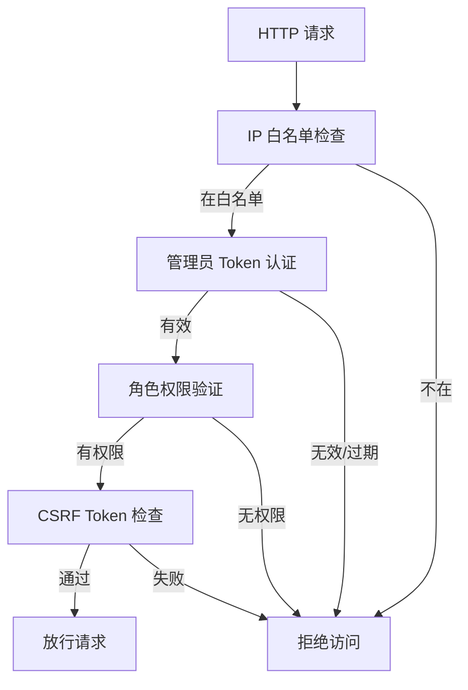

# 中间件 (Middleware)

HTTP 请求过滤层，处理认证、CSRF 保护、请求预处理等功能。

## 结构

```
app/Http/Middleware/
├── AdminAuthn.php (134行)               # 后台认证中间件(IP白名单/Token/权限)
├── Authenticate.php                      # 用户认证中间件
├── EncryptCookies.php                    # Cookie 加密
├── PreventRequestsDuringMaintenance.php  # 维护模式检测
├── RedirectIfAuthenticated.php           # 已登录重定向
├── TrimStrings.php                       # 字符串 Trim
├── TrustHosts.php                        # 允许的主机名校验
├── TrustProxies.php                      # 信任的代理 IP
└── VerifyCsrfToken.php                   # CSRF Token 验证
```

## 关键文件

| 文件 | 目的 |
|------|------|
| `AdminAuthn.php` | 核心后台安全中间件: IP 白名单检查 → 管理员 Token 认证 → 角色权限验证 → CSRF Token 检查。四重验证保障后台安全 |
| `VerifyCsrfToken.php` | 排除 Stripe Webhook 路径 `/stripe/*`，允许外部回调 |
| `Authenticate.php` | Laravel 标准认证中间件，检查用户是否已登录 |

## AdminAuthn 中间件详解



## 中间件分配

中间件在以下位置配置:
- **全局中间件**: `app/Http/Kernel.php` 的 `$middleware` 属性
- **Web 中间件组**: `app/Http/Kernel.php` 的 `$middlewareGroups['web']`
- **路由中间件**: `config/app_portal.php` 的中间件映射(`admin => admin.authn`)
- **API 中间件组**: `app/Http/Kernel.php` 的 `$middlewareGroups['api']`

## 依赖

**本模块依赖**:
- `app/Models/User.php` - 管理员认证和权限
- `app/Models/Setting.php` - IP 白名单配置
- Laravel Session/Cookie

**依赖本模块的**:
- RouteMapping - 后台路由应用 AdminAuthn
- Laravel Kernel - 全局和路由组中间件

## 注意事项

1. `StripeWebhookController` 路径在 `VerifyCsrfToken` 中被排除，无需 CSRF Token
2. IP 白名单从 `setting` 表读取，管理页可动态修改
3. 角色权限通过 `user_role` 表的 `allowed` JSON 字段控制
