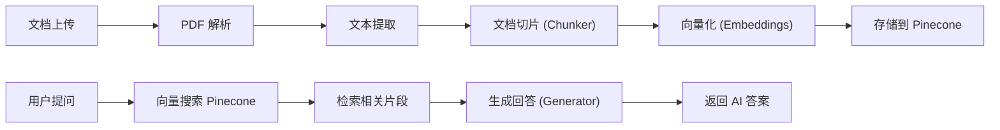

# 业务服务 (Services)

业务逻辑层，封装核心领域的业务规则。当前包含 AI 会话流推荐服务和 RAG 文档检索增强生成模块。

## 结构

```
app/Services/
├── ConversationFlowService.php (1211行) # 会话流推荐服务
├── DocumentAnalysisService.php           # 文档分析服务
└── Rag/                                  # RAG 检索增强生成模块
    ├── Chunker.php                       # 文档切片器
    ├── Embeddings.php                    # 文本嵌入向量生成
    ├── Generator.php                     # 基于检索生成回答
    └── Pinecone.php                      # Pinecone 向量数据库操作
```

## 关键文件

| 文件 | 目的 |
|------|------|
| `ConversationFlowService.php` | 核心推荐引擎: 根据用户聊天内容评分(关键词+行为信号)，触发套餐升级提示，管理冷却和频率控制 |
| `DocumentAnalysisService.php` | PDF/文档内容提取和结构化分析 |
| `Rag/Chunker.php` | 将长文档按段落/语义切分为小块 |
| `Rag/Embeddings.php` | 调用嵌入 API 将文本块转为向量 |
| `Rag/Pinecone.php` | Pinecone 向量数据库的索引和搜索操作 |
| `Rag/Generator.php` | 基于检索到的相关文本块 + AI 模型生成最终回答 |

## ConversationFlowService 详解

评分系统（>5分触发提示）基于:
- 用户消息中的关键词匹配(如"复杂"、"不知道"、"需要帮助")
- 用户当前套餐级别(低等级分数权重更高)
- 对话轮次和深度
- 用户行为信号(频繁提问、长时间对话)

五个套餐升级路径:
1. Free(免费) → AI Smart Plan(`all_ai`) → 触发条件: 超过免费限额
2. AI Smart → Hybrid Expert Plan(`hybrid`) → 关键词: 复杂案例、需要专家
3. Hybrid → Premium Confidence Plan(`premium`) → 关键词: 深度分析、文件审查
4. Premium → VIP Global Partner Plan(`vip`) → 关键词: 多国方案、全流程

冷却机制:
- 同类型提示间隔至少 24 小时
- 不同类型提示至少间隔 8 小时
- 每次升级后 7 天内不推荐同级/降级套餐

## RAG 工作流



## RAG 状态

当前 RAG 模块大部分功能已禁用或未完全启用:
- `RagController.php` API 控制器 → 已禁用
- `Console/Commands/RagIngest.php` 命令 → 已禁用
- 文档上传和分析功能通过 `DocumentController` 和 `DocumentAnalysisService` 仍然可用(无 RAG 部分)

## 依赖

**本模块依赖**:
- `app/Models/` - Member/Chatlog/DocumentUpload 等模型
- `config/conversation_flows.php` - 会话流规则配置
- `Pinecone` - 向量数据库(仅 RAG 使用)
- `smalot/pdfparser` - PDF 解析(文档分析)

**依赖本模块的**:
- `app/Http/Controllers/Web/Home.php` - AI 聊天使用 ConversationFlowService
- `app/Http/Controllers/Api/DocumentController.php` - 文档管理使用 DocumentAnalysisService

## 规范

### 服务类设计
- 服务类为单例模式或静态方法集合，无状态
- 会话状态通过外部存储(Cookie/Session/DB)管理
- 不直接操作 HTTP 请求/响应，由控制器调用

### 添加新服务
1. 在 `app/Services/` 创建 PHP 文件
2. 实现业务逻辑方法
3. 在控制器中注入或直接实例化调用
